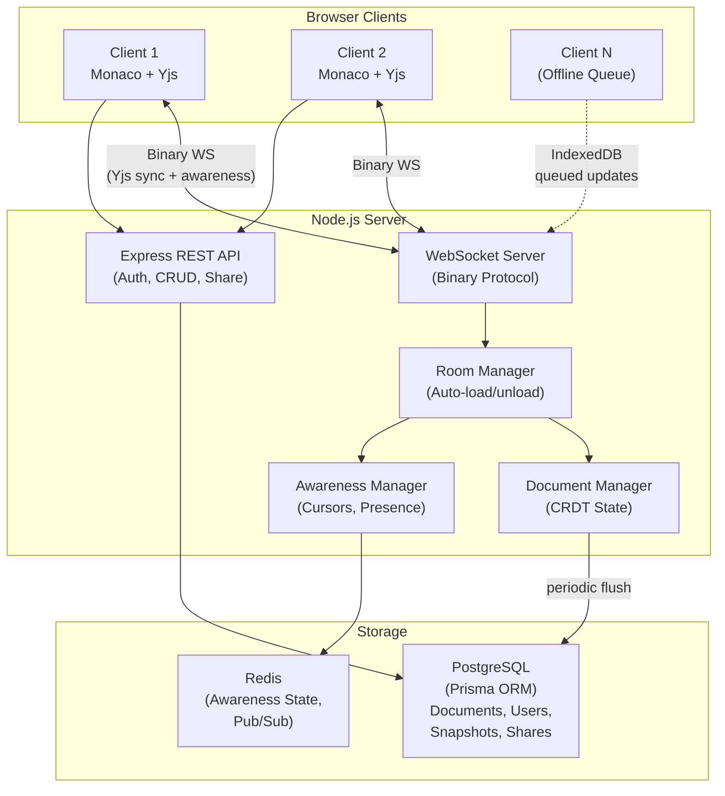

<p align="center">
  <h1 align="center">CRDT Collaboration Engine</h1>
  <p align="center">
    Real-time collaborative code editor built with CRDTs (Yjs), binary WebSocket protocol, Monaco Editor, and offline-first architecture.
  </p>
</p>

<p align="center">
  
  
  
  
  
  
  
  
  
</p>

---

## Overview

A collaborative code editor that enables multiple users to edit the same document simultaneously with zero conflicts. Built on Yjs CRDTs (Conflict-free Replicated Data Types), it eliminates the need for Operational Transform by mathematically guaranteeing convergence. Communication uses a custom binary WebSocket protocol for minimal overhead, with Redis-backed awareness for live cursor positions and user presence. Supports offline editing with IndexedDB queuing, version history with named snapshots, and role-based access control (owner/editor/viewer).

## Architecture



## Features

| Feature | Description |
|---------|-------------|
| **CRDT Editing** | Yjs ensures conflict-free merging across all clients, no OT needed |
| **Binary WebSocket** | Custom binary protocol with multiplexed message types for minimal overhead |
| **Awareness Protocol** | Live cursor positions, text selections, and user presence indicators |
| **Monaco Editor** | VS Code-quality editing with syntax highlighting for 50+ languages |
| **Offline Support** | IndexedDB queue for updates made while disconnected, auto-sync on reconnect |
| **Document Persistence** | Automatic Yjs state save to PostgreSQL with periodic flush |
| **Version History** | Named snapshots with one-click restore capability |
| **Access Control** | Owner/editor/viewer roles with document sharing via email |
| **Room Management** | Multiple concurrent documents with automatic load/unload on empty |
| **REST API** | Full CRUD for documents, users, authentication, and sharing |
| **Auth** | JWT-based registration and login |

## WebSocket Protocol

Binary frames: `[1 byte type][N bytes payload]`

| Type | Name | Direction | Description |
|------|------|-----------|-------------|
| `0` | `SYNC_STEP_1` | Bidirectional | Yjs sync step 1 (state vector) |
| `1` | `SYNC_STEP_2` | Bidirectional | Yjs sync step 2 (diff) |
| `2` | `SYNC_UPDATE` | Bidirectional | Yjs document update |
| `3` | `AWARENESS` | Bidirectional | Cursor/selection/presence |
| `10` | `AUTH` | Client -> Server | JWT + documentId handshake |
| `11` | `AUTH_OK` | Server -> Client | Authentication accepted |
| `12` | `AUTH_ERR` | Server -> Client | Authentication rejected |
| `20` | `PING` | Client -> Server | Keep-alive |
| `21` | `PONG` | Server -> Client | Keep-alive response |

## Quick Start

```bash
# Clone
git clone https://github.com/damn8daniel/crdt-collaboration-engine.git
cd crdt-collaboration-engine

# Start infrastructure
docker compose up -d postgres redis

# Install dependencies
npm install

# Set up database
cp .env.example .env
npx prisma migrate dev --name init
npx prisma db seed

# Run development servers
npm run dev
```

Open http://localhost:3000 in multiple browser tabs to test real-time collaboration.

## API Reference

### Auth

| Method | Endpoint | Description |
|--------|----------|-------------|
| `POST` | `/api/auth/register` | Register new user |
| `POST` | `/api/auth/login` | Login (returns JWT) |
| `GET` | `/api/auth/me` | Current user info |

### Documents

| Method | Endpoint | Description |
|--------|----------|-------------|
| `GET` | `/api/documents` | List user's documents |
| `POST` | `/api/documents` | Create new document |
| `GET` | `/api/documents/:id` | Get document details |
| `PATCH` | `/api/documents/:id` | Update title/language |
| `DELETE` | `/api/documents/:id` | Delete document |
| `POST` | `/api/documents/:id/share` | Share with another user |

### Version History

| Method | Endpoint | Description |
|--------|----------|-------------|
| `GET` | `/api/documents/:id/snapshots` | List snapshots |
| `POST` | `/api/documents/:id/snapshots` | Create named snapshot |
| `POST` | `/api/documents/:id/snapshots/:sid/restore` | Restore snapshot |

### WebSocket

| Endpoint | Description |
|----------|-------------|
| `WS /ws` | Binary CRDT sync (auth via message type `10`) |

## Project Structure

```
crdt-collaboration-engine/
├── src/
│   ├── server/
│   │   ├── index.ts               # Express + WS server entry point
│   │   ├── config.ts              # Server configuration
│   │   ├── auth.ts                # JWT authentication
│   │   ├── db.ts                  # Prisma client
│   │   ├── redis.ts               # Redis (ioredis) client
│   │   ├── routes/
│   │   │   ├── auth.routes.ts     # Auth endpoints
│   │   │   └── document.routes.ts # Document CRUD + sharing + snapshots
│   │   ├── ws/
│   │   │   ├── WebSocketServer.ts # Binary WS handler, message routing
│   │   │   └── RoomManager.ts     # Document rooms (load/unload, client tracking)
│   │   └── crdt/
│   │       ├── DocumentManager.ts # Yjs Doc lifecycle, persistence, snapshots
│   │       └── AwarenessManager.ts# Cursor and presence sync via Redis
│   ├── client/
│   │   └── src/
│   │       ├── components/
│   │       │   ├── EditorPage.tsx      # Monaco + Yjs binding
│   │       │   ├── DocumentListPage.tsx# Document list with create/delete
│   │       │   ├── PresenceBar.tsx     # Live user avatars and cursors
│   │       │   ├── VersionHistory.tsx  # Snapshot list and restore UI
│   │       │   ├── ShareDialog.tsx     # Document sharing modal
│   │       │   ├── LoginPage.tsx       # Login form
│   │       │   └── RegisterPage.tsx    # Registration form
│   │       ├── hooks/
│   │       │   └── useAuth.tsx         # Auth context and hooks
│   │       └── utils/
│   │           ├── api.ts              # REST API client (Axios)
│   │           └── offlineQueue.ts     # IndexedDB offline queue
│   └── shared/
│       ├── protocol.ts            # Binary message type constants
│       ├── types.ts               # Shared TypeScript types
│       └── constants.ts           # Shared constants
├── prisma/                        # Prisma schema + migrations
├── docker/                        # Docker setup
├── docker-compose.yml             # PostgreSQL + Redis
├── package.json
├── tsconfig.json / tsconfig.server.json
├── vite.config.ts                 # Vite for client
└── tailwind.config.js
```

## Tech Stack

| Layer | Technology |
|-------|-----------|
| CRDT | Yjs, y-protocols, lib0 |
| Transport | WebSocket (ws), custom binary protocol |
| Backend | Node.js, Express, TypeScript |
| Frontend | React 18, Monaco Editor, Tailwind CSS |
| Database | PostgreSQL (Prisma ORM) |
| Cache/Presence | Redis (ioredis) |
| Offline Storage | IndexedDB |
| Infrastructure | Docker, Docker Compose |

## License

MIT
